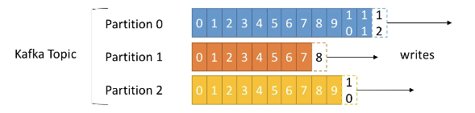

# Kafka notes

## The problem Kafka tries to solve is: 

If you have 4 'main' services, and 6 'sub' services, you need to write 24 integrations all both the 'main' and the 'sub' level. 

## Why Apache Kafka

- Distributed, resilient architecture that is fault tolerant
- Horizontal scalability (can scale 100s of brokers and millions of messages per second)
- High performance (latency of less than 10ms) 
- Used by the big dogs (Netflix, LinkedIN, Uber, Walmart)

## Usecases

- Netflix uses kafka to apply recommendations in real-time
- Uber uses it to gather user, taxi and trip data in real-time to compute forecast demand and computer surge-pricing in real-time
- LinkedIN uses it to prevent spam, collect user interactions and make better connection recommendations. 

**Remember** - Kafka is only used as a transportation mechanism! You still need to write applications to make things work. 

## My objectives

- Ability to use Kafka on the CLI

## Topics, partitions and offsets

**Topic**

Topics are a particular stream of data.

- A good way to think about a topic is a table in a DB. 
- You can have as many topics as you want
- A topic is identified by its name

Topics are split in _partitions_

- Each partition is ordered (starting at 0)
- Each message within a partition gets an incremental id called *offset* (also starting at 0)

When you create a topic, you need to specify how many partitions you want. You can change this later on. 

Now, when you start getting messages into the topic, the first one going into partition 0, starts with *id* or *offset* 0. 

