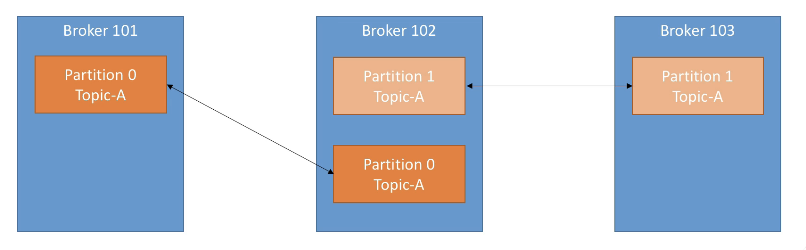
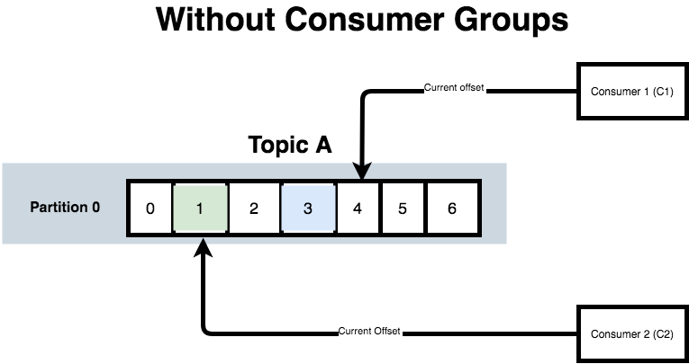

# Kafka notes

## The problem Kafka tries to solve is:

If you have 4 'main' services, and 6 'sub' services, you need to write 24 integrations all both the 'main' and the 'sub' level.

## Why Apache Kafka

- Distributed, resilient architecture that is fault tolerant
- Horizontal scalability (can scale 100s of brokers and millions of messages per second)
- High performance (latency of less than 10ms)
- Used by the big dogs (Netflix, LinkedIN, Uber, Walmart)

## Usecases

- Netflix uses kafka to apply recommendations in real-time
- Uber uses it to gather user, taxi and trip data in real-time to calculate forecast demand and compute surge-pricing in real-time
- LinkedIN uses it to prevent spam, collect user interactions and make better connection recommendations.

**Remember** - Kafka is only used as a transportation mechanism! You still need to write applications to make things work.

## Topics, partitions and offsets

**Topic**

Topics are a particular stream of data.

- A good way to think about a topic is a table in a DB.
- You can have as many topics as you want
- A topic is identified by its name

Topics are split in _partitions_

- Each partition is ordered (starting at 0)
- Each message within a partition gets an incremental id called _offset_ (also starting at 0)

When you create a topic, you need to specify how many partitions you want. You can change this later on.

Now, when you start getting messages into the topic, the first one going into partition 0, starts with _id_ or _offset_ 0.


In this case above, we have 3 partitions (0, 1 and 2).

The first message into partition 0 will have offset 0, then 1, 2 and so on..

To refer to a message, we'll be referring to it as `Partition 0, offset 0` etc.

**Topic example use case**


- You have a fleet of trucks. Each truck reports its GPS position to Kafka.
- We can have a topic `trucks_gps` as the topic that contains the position of all trucks in the fleet.
- Each truck will send a message to Kafka every 20 seconds.
- Each message will contain the truck ID and the truck position (lat long).

**Note**: _The location dashboard & notification service in the diagram above are our consumers_. _More on that later_.

Our `trucks_gps` topic will have an arbitrary number of partitions (let's say 10).

A few gotchas:

- Offsets only have a meaning if you know what partition its in (Offset 1 in partition 0 is totally a different message to Offset 1 in partition 1 for example)
- Order is only guaranteed within a partition. For eg: we can guarantee that offset 5 in partition 0 has been written before offset 6, 7 and 8. BUT we cannot offset 5 in partition 1 was written before offset 6 in partition 0.
- Data is only kept for a limited period of time (by default for 1 week).
  The data inside the offsets will be deleted, but it's immutable. You cannot update it and even once it's deleted, you will have to add it to another offset.
- Data is assigned randomly to a partition unless a key is provided. So if you try to add a message without a key, it will be added to partition 0, 1 or 2 and we can't control that.

# Brokers

- A Kafka cluster is composed of multiple brokers (or servers).

- Each broker is identified by an ID (which is always a number)

- Each broker will contain certain topic partitions, so it will have some of the data but not all the data because Kafka is distributed.

- When you're connected to a particular Kafka broker (called a bootstrap broker), you will be connected to the entire cluster.

- A good number to get started is 3 brokers, but some big clusters have over 100 brokers.

# Brokers & Topics

Let's say we have 3 brokers (101, 102 & 103):


Let's say we have a topic called `Topic-A` and it has **3 partitions**

Our topic, on creation, is distributed amongst our brokers by Kafka. Note that there is no relation between our partition number and broker ID.


Say we have another topic `Topic-B`, and this topic only has **2 partitions**.


Data is distributed and Broker 103 doesn't have any topic B data.

## Topic replication factor

Kafka is a distributed system. In a distributed system, we need replication for resiliency. If a machine goes down, the system cannot just stop serving up data.

- Topics should have a replication factor > 1 (usually between 2 & 3, and 3 being the gold standard).
- When you create a topic, you want it to be replicated. If a broker is down, then another broker can serve the data you need.

Let's consider this in a new example:

Our topic here is called `Topic-A`, and has two partitions (`partition 0` and `partition 1`).


We also have a replication factor of 2. Which will mean our partitions will be replicated twice, like so:



Let's look at what happens if we lose Broker 102 in our example:


Even with broker 102 down, we still have access to all our data!

## Partition leaders

The golden rule is:

- At any given time, only ONE broker can be a leader for a given partition.
  Only that leader can receive and serve data for a partition.
- The other brokers will only passively sync the data for that partition.
- Each partition has one leader and multiple in-sync replicas (ISR).

For partition 0, broker 101 is the leader and broker 102 is the ISR.
For partition 1, broker 102 is the leader and broker 103 is the ISR.

The system that decides leaders and ISRs is called `Zookeeper`. If a broker goes down, there's an election to decide the new leader. Once the broker that went down comes back up - it will try to become the leader again after syncing all the data.

# Producers

- Producers write data to topics (which in turn is made of partitions)
- Producers automatically know which broker and partition to write to
- In case of broker failures, producers will automatically recover (this is part of kafka).

Here's the sequence diagram:


Our producer will send data to our brokers. Basically, if the data does not have a key - that data will be sent round robin to broker 101, 102 and 103.

The producer automatically load balances, i.e. it sends a bit to 101, a bit to 102 and a bit to 103.

If we take this exact same topic, let's look at how the producer does it's job.

Producers can choose to receive ackowledgement of data writes.

```
acks=0: Producer won't wait for ackowledgement of data write
acks=1: Producer will wait for leader acknowledgment of data write
acks=all: Leader + replicas send acknowledgement of data write
```

## Message keys for producers

- Producers can choose to send a key with messages (can be a string, number etc)
- If key=null, data is sent round robin (broker 101, then 102, then 103).
- If a key is sent to the producer, then all messages for that key will always go to the same partition
- A key is basically sent if you need message ordering for a specific field (eg: truck_id)

### Truck example

If we go back to the earlier trucking example (1000 trucks in a fleet, all sending their lattitude and longitude every 20 seconds along with the truck ID):

- For a given truck, we want the GPS data for that truck (say truck id: 123) to be in order
- We'll choose this truck id 123 as the key when we send messages to the producer.
- When a truck id is present, this data will always go to the same partition (for eg: partition 0)
- This mechanism of a certain key going to a certain partition is known as **key hashing**.

# Consumers

- Consumers read data from a topic (identified by name)
- Consumers know which broker to read from (part of Kafka)
- In case of broker failures, consumers know how to recover
- Data is read in order within each partition


In the diagram above, the consumer will read data at offset 0 before reading the data at offset 3, before reading the data at offset 10, and so on.

**But there's no ordering between two separate partitions**


Again, there's no guarantee of order between two separate partitions. It might read offset 3 on partition 1 before reading offset 2 on partition 0 (for example).

## Consumer Groups

- A consumer can be a node app (for example).
- Consumers read data in consumer groups.
- Each consumer within a group reads from exclusive partitions.
- If you have more consumers than partitions, some consumers will be inactive.

**Why do we need consumer groups?**
[Reference: YouTube video](https://www.youtube.com/watch?v=Z1_7K_2WTDc)

#### Scenario: 1 Topic 1 partition, 2 consumers (no groups)



Here we have `Topic A`, with a single partition, and with 2 consumers. They are both reading from it, but have different offsets (eg: Consumer 1 is reading at offset 1) and there's no co-ordination between them.

**Note**: The offset background colours represent messages with different key values.

> For eg: the green one might have `key value: 123`, and blue one might have `key value: 456`.

#### Scenario: 1 Topic, 2 partitions, 2 consumers (no groups)


Both consumers `C1` and `C2` read from the topics independently of one another, and they will read from each partition on their own.

But, what happens if we set a consumer group now?

#### Scenario: 1 Topic, 2 partitions, 2 consumers in a consumer group


Now each consumer will be assigned a particular partition.

#### Scenario: 1 Topic, 2 partitions, 3 consumers in a consumer group


In this scenario, we can choose to have an 'extra' consumer i.e. one more than the number of partitions we have. This consumer will be idle, and only be used if `C2` dies (for whatever reason). Essentially, `C3` is a stand-in in case something breaks, and it can seamlessly become the stand-in and keep things running smoothly.

#### Scenario: 1 Topic, multiple partitions, 2 consumers in a consumer group


Our partitions will automatically get divided (odd or even) between the available consumers in our consumer group.

# Consumer offsets

- Kafka stores the offsets at which a consumer group has been reading
- The offsets committed live in a kafka topic named `__consumer_offsets`.
- When a consumer in a group has processed data received from Kafka, it should be committing the offsets
- If a consumer dies, it will be able to read back from where it left off thanks to the committed consumer offsets.


## Delivery semantics for consumers

Consumers choose when to commit offsets

There are 3 delivery semantics:

1. **At most once**

- Offsets commited as soon as the message is received - BEFORE it is processed.
- If the processing of this message goes wrong, it won't be read again

2. **At least once**

- Offsets are committed AFTER a message is processed.
- If processing goes wrong, the message will be read again.
- This can result in duplicate processing of messages. Due to this, care has to be taken so the message processins is idempotent. (if we end up processing the same message again, it won't impact other systems).

3. **Exactly once**

- This can be achieved for Kafka to Kafka workflows using the Kafka Streams API.
- For Kafka to external system workflows, use an idempotent consumer.

# Kafka Broker Discovery

- Every Kafka server is also called a `bootstrap server`.
- We only need to connect to one broker and we'll be connected to the entire cluster.
- Each broker knows about all brokers, topics and partitions (metadata).

Say we have a Kafka cluster with 5 brokers (101, 102 etc)


Once a client (can be a producer or a consumer) connects to a broker (above it's `Broker 101`) and makes a request for metadata, we get a list of all brokers. We can now utilise this metadata and connect to the needed brokers.

This is the mechanism of how the client can connect to the entire cluster from a single connection with a broker.

# Zookeeper

- Zookeper manages brokers (keeps a list of them)
- Zookeeper helps in performing leader election for partitions
- Zookeeper sends notifications to Kafka in case of changes (for eg: if a new topic, broker dies, broker comes up, topics are deleted etc)
- Kafka cannot work without zookeeper
- Zookeeper by design operates with an odd number of servers (3, 5, 7, ...)
- Zookeeper also has a concept of a leader (handles writes), and the rest of the servers are followers (handles reads). Your producers and consumers don't write to Zookeeper directly, they write to Kafka. Kafka manages its own metadata in Zookeeper
- Zookeeper does not store consumer offsets after Kafka V0.10

Here's what zookeeper looks like in action (note the 1 leader and 2 followers)


# Kafka guarantees

- Messages are appended to the topic-partition in the order they are sent
- Consumers read messages in the order stored in a topic partition
- With a replication factor of `N`, producers and consumers can rolerate upto `N - 1` brokers being down
- This is why a replication factor of 3 is a good idea:
  - This allows one broker to be taken down for maintenance
  - In addition, it allows for another broker to be taken down unexpectedly
- As long as the number of partitions remain constant for a topic (no new partitions are added), the same key will point to the same partition

# Summary


# Install Kafka on Mac

[This is an easy to follow guide](https://medium.com/@Ankitthakur/apache-kafka-installation-on-mac-using-homebrew-a367cdefd273) on medium to get Kafka set up locally, since I ran into some issues.

Other options to run Kafka include in a docker container

(Also look into Kafka console consumer, Kafka console producer and Kafka cat to use in the place of Kafka console consumer).

## Commands

**Start Zookeeper**

```
zookeeper-server-start /usr/local/etc/kafka/zookeeper.properties
```

**Start kafka server**

```
kafka-server-start /usr/local/etc/kafka/server.properties
```


As mentioned in the article above, if you face issues running `kafka-server-start /usr/local/etc/kafka/server.properties`

and get this error:

```
[2018-08-28 16:24:41,166] WARN [Controller id=0, targetBrokerId=0] Connection to node 0 could not be established. Broker may not be available. (org.apache.kafka.clients.NetworkClient)
[2018-08-28 16:24:41,268] WARN [Controller id=0, targetBrokerId=0] Connection to node 0 could not be established. Broker may not be available. (org.apache.kafka.clients.NetworkClient)
```

you will need to substitute the value of `listeners` in `/usr/local/etc/kafka/server.properties` to

```
listeners=PLAINTEXT://localhost:9092
```
**Creating topics**

To create a new topic

```bash
kafka-topics --bootstrap-server localhost:9092 --topic first_topic --create

# OR

kafka-topics --zookeeper localhost:2181 --topic third_topic --create --partitions 6 --replication-factor 1

```

> If you call --bootstrap-server and don't provide the number of partitions (using `--partitions`) or the replication factor (using `--replication-factor`), they both default to 1. However, if you use --zookeeper, it will throw an error unless you specify values for those arguments.

To list all the topics

```bash
kafka-topics --bootstrap-server localhost:9092 --list
# OR kafka-topics --zookeeper localhost:2181 --list

# first_topic
```

To get more information about a topic:

```bash
kafka-topics --bootstrap-server localhost:9092 --topic first_topic --describe

# Topic: first_topic	PartitionCount: 1	ReplicationFactor: 1	Configs: segment.bytes=1073741824
# 	Topic: first_topic	Partition: 0	Leader: 0	Replicas: 0	Isr: 0
```

Making a second partition, while specifying replication factor and partitions:

```bash
kafka-topics --bootstrap-server localhost:9092 --topic second_topic --create --partitions 6 --replication-factor 1
```

This is what `second_topic` looks like:

```bash
kafka-topics --bootstrap-server localhost:9092 --topic second_topic --describe
Topic: second_topic	PartitionCount: 6	ReplicationFactor: 1	Configs: segment.bytes=1073741824
	Topic: second_topic	Partition: 0	Leader: 0	Replicas: 0	Isr: 0
	Topic: second_topic	Partition: 1	Leader: 0	Replicas: 0	Isr: 0
	Topic: second_topic	Partition: 2	Leader: 0	Replicas: 0	Isr: 0
	Topic: second_topic	Partition: 3	Leader: 0	Replicas: 0	Isr: 0
	Topic: second_topic	Partition: 4	Leader: 0	Replicas: 0	Isr: 0
	Topic: second_topic	Partition: 5	Leader: 0	Replicas: 0	Isr: 0
```

To delete a topic:

```bash
kafka-topics --zookeeper localhost:2181 --topic second_topic --delete

# Topic second_topic is marked for deletion.
# Note: This will have no impact if delete.topic.enable is not set to true.
```

Note that `delete.topic.enable` is set to true by default. 

# Kafka console producer CLI

Launch the producer by using `kafka-console-producer` 

```bash
kafka-console-producer --broker-list 127.0.0.1:9092 --topic first_topic
>Hello World # This is your message
```
In case you don't already have that topic created, and you try to produce messages, you'll see this
```bash
kafka-console-producer --broker-list 127.0.0.1:9092 --topic some_topic
>Hello World
# => [2020-07-25 13:31:20,865] WARN [Producer clientId=console-producer] Error while fetching metadata with correlation id 3 : {new_topic_1=LEADER_NOT_AVAILABLE} (org.apache.kafka.clients.NetworkClient)

```
This will go away after the first attempt, as `kafka-producer` resolved this issue and elects a leader for the new topic called `new_topic_1`. 

### Sidenote

If you create new topics this way, the partitions and replication factor will be set to 1

You can change this default like so:

```bash
cd /usr/local/etc/kafka
vim server.properties 
```
Look for the 'Log Basics' section

```
############################# Log Basics #############################

# A comma separated list of directories under which to store log files
log.dirs=/usr/local/var/lib/kafka-logs

# The default number of log partitions per topic. More partitions allow greater
# parallelism for consumption, but this will also result in more files across
# the brokers.
num.partitions=3

# The number of threads per data directory to be used for log recovery at startup and flushing at shutdown.
# This value is recommended to be increased for installations with data dirs located in RAID array.
num.recovery.threads.per.data.dir=1
```
The `num.partitions` value is what you're after. Here I've modified it from 1 to 3. 

# Kafka console consumer CLI

To consume messages, let's try listening for `first_topic`.

```bash
kafka-console-consumer --bootstrap-server 127.0.0.1:9092 --topic first_topic
```

Nothing happens yet, as the consumer will start listening only from the point it was launched. 

If we now put some messages onto the `first_topic` topic in a separate terminal, while keeping the terminal with the above command going simultaneously: 

```bash
kafka-console-producer --broker-list 127.0.0.1:9092 --topic first_topic 
> Hello World!
```

You should see the `Hello World!` message being consumed in the consumer terminal window. 

*add the `--from-beginning` read all the messages from the beginning*

```bash
kafka-console-consumer --bootstrap-server 127.0.0.1:9092 --topic first_topic --from-beginning
```
You should now see all the messages sent to the `first_topic` topic. 

## Adding Kafka consumer groups

Keep the producer going as is, if you have it going. Cancel out of consumers as we're going to create a consumer group to run our consumers

In this case, I have a producer for topic `new_topic_1` (which has 3 partitions - 0, 1, 2) producing messages. We're now going to create a consumer group called `consumer_group_2`:

```bash
kafka-console-consumer --bootstrap-server 127.0.0.1:9092 --topic new_topic_1 --group consumer_group_2
```

We should now be getting messages as usual. Now, open another terminal window to repeat the above command. Messages from your producer should now get divided between the 2 consumers. You can repeat this process and have 3 consumers in the same group `consumer_group_2` consuming messages from the same producer. 


